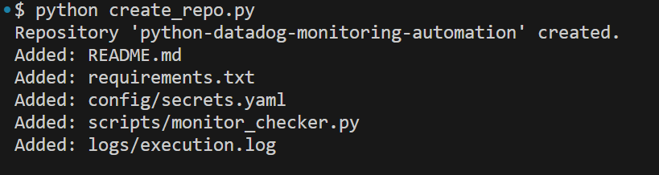
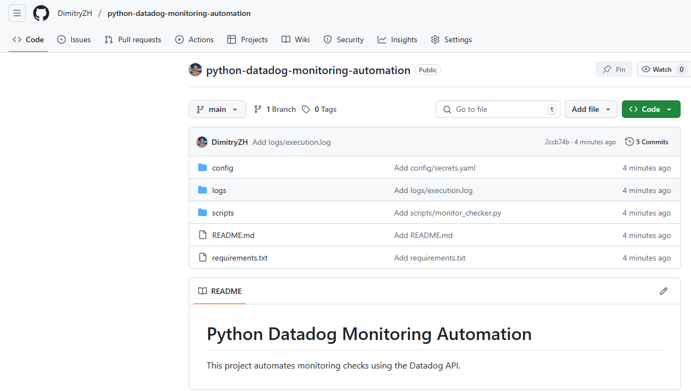

# Automating GitHub Repository Creation with Python

This project contains a Python script that automates the creation of a new GitHub repository with a predefined folder structure. It demonstrates how to use the GitHub API (via the `PyGithub` library) to programmatically create and initialize a DevOps-ready repository.


##  Technologies Used
- Python 3.x  
- [PyGithub](https://pypi.org/project/PyGithub/)  
- GitHub REST API 

##  Use Case Example

The script can be used to generate repositories like:

```bash
python-datadog-monitoring-automation/
├── config/
│   └── secrets.yaml          # Stores API keys and Slack webhook
├── scripts/
│   └── monitor_checker.py    # Main monitoring script
├── logs/
│   └── execution.log         # Optional log file
├── README.md
└── requirements.txt
```

This structure is suitable for DevOps automation scripts, particularly for monitoring tools like Datadog.

##  Getting Started

### 1. Install dependencies

```bash
pip install PyGithub
```
## 2. Create a GitHub Personal Access Token

Generate a token with **`repo`** scope from [GitHub Developer Settings](https://github.com/settings/tokens).

---

## 3. Configure and Run the Script

Replace the `GITHUB_TOKEN` variable in `create_repo.py` with your token, then run:

```bash
python create_repo.py
```

##  What the Script Does

- Connects to your GitHub account using your token  
- Creates a new repository (e.g., `python-datadog-monitoring-automation`)  
- Adds folders and files such as:
  - `config/secrets.yaml`
  - `scripts/monitor_checker.py`
  - `logs/execution.log`
  - `README.md`
  - `requirements.txt`


###  Screenshots

####  Script Output


####  GitHub Repository Structure


##  Summary

This script is ideal for:

- DevOps and Cloud Engineers looking to automate the setup of new GitHub repositories  
- Anyone who frequently creates standardized, template-based project structures programmatically  
- Developers seeking to streamline project initialization workflows using Python and the GitHub API
