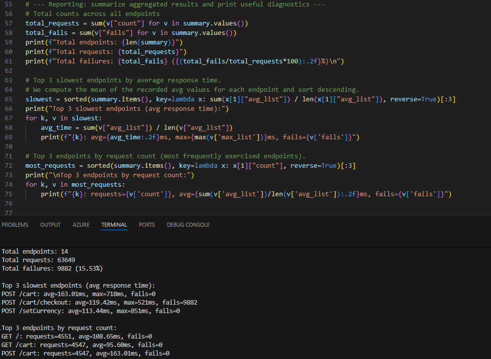

# Kubernetes Load Test Log Analysis with Python

This project provides a Python-based solution for analyzing **Locust** load test logs generated during performance testing of Kubernetes microservices applications.  
It automates log parsing and summarizes performance metrics, helping DevOps engineers identify performance bottlenecks and track system reliability over time.

---

## 📂 Project Structure

K8s-Load-Test-Log-Analysis-with-Python
│
├── analyze_locust_logs.py # Script to parse and summarize Locust log files
├── locustfile.py # Locust test definition simulating user behavior
├── default_locust_test_logs.txt # Example Locust logs collected from Kubernetes
├── default_logs_report.png # Example visualization of analysis output
└── README.md # Project documentation


---

## 🚀 Overview

### 1. **Load Testing with Locust**

The included `locustfile.py` defines user behavior for a sample microservices application (such as **Online Boutique**).  
It simulates realistic traffic patterns including browsing, adding products to cart, and performing checkouts.

To run the test locally or inside Kubernetes:

```bash
locust -f locustfile.py --headless -u 100 -r 10 -t 5m --host http://app-url
``` 
or use default data from loadgenerator pod 

```bash
kubectl logs <loadgenerator-pod-name > default_locust_test_logs.txt
``` 

2. Analyzing Logs

The [analyze_locust_logs.py](analyze_locust_logs.py) script parses Locust’s text logs 
[default_locust_test_logs.txt](default_locust_test_logs.txt) to extract endpoint-level metrics:

Average, minimum, maximum, and median response times

Failure counts

Most frequently requested endpoints

Top slowest endpoints

Run the analysis:
```bash
python analyze_locust_logs.py
``` 

Example output:




## Code Summaries:

- **analyze_locust_logs.py**

This script analyzes Locust performance test logs and produces summarized metrics for each API endpoint.
It:

Uses a regex pattern to extract HTTP method, path, failures, and latency stats from raw logs.

Aggregates metrics (avg/min/max/median) for each endpoint.

Prints a concise performance summary with:

Total requests and failures

Top 3 slowest endpoints by response time

Top 3 most frequently requested endpoints

DevOps use case: Automate post-test log analysis and integrate with CI/CD to detect regressions or performance degradation automatically.

- **locustfile.py**

This file defines realistic user workflows for testing a Kubernetes-hosted microservices application (such as an e-commerce app).
It simulates real traffic using Locust’s FastHttpUser class and TaskSet behavior model.

Included user actions:

Homepage visit

Product browsing and adding items to the cart

Currency change

Checkout with generated fake payment data

Logout flow

Each task is assigned a weight to reflect its frequency during testing, and a random wait time (1–10s) between actions simulates natural user pacing.

DevOps use case: Stress test the application to evaluate performance, scalability, and reliability before production releases.

## Use Cases

Performance Monitoring: Detect slow endpoints automatically during CI/CD test stages.

Regression Tracking: Compare multiple test runs to identify performance drifts.

Scalability Insights: Understand microservice responsiveness under varying load conditions.

## Future Enhancements

Export parsed metrics to JSON or CSV

Visualize trends using Grafana or Prometheus

Integrate with GitHub Actions or Jenkins for automated performance reporting